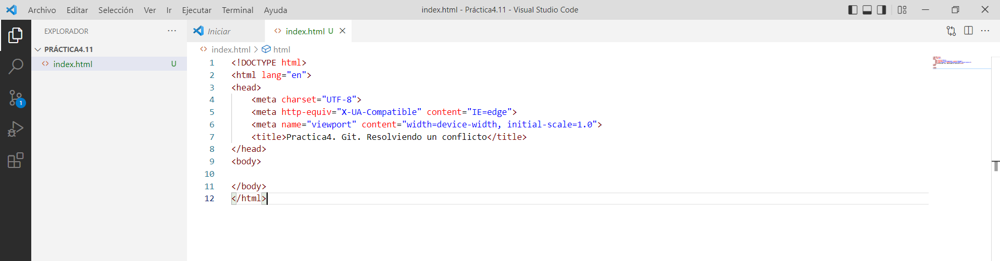
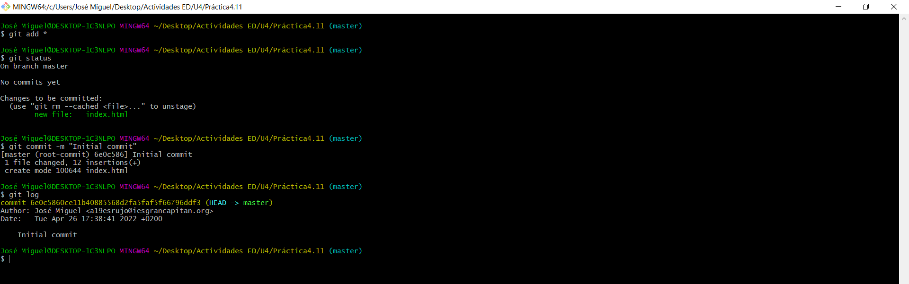

# Tarea 4.11. Practica4. Git. Resolviendo un conflicto

En esta práctica vas a trabajar sobre un repositorio con varias ramas. 

- master (la de por defecto)
- rama-1
- rama-2
  
Generarás un conflicto en un fichero y lo resolverás. Cuando hayas fusionado todos los cambios de forma correcta eliminarás las ramas correctamente fusionadas para quedarte SOLO con la rama master. Una vez realizada la práctica harás una copia en [este](https://github.com/iesgrancapitan-eed/practica4-git-resolviendo-un-conflicto-JMER15) repositorio remoto

Documenta los siguientes pasos:

**1. Asegúrate de que tienes configurado el editor Visual Studio Code como tu editor de Git. (git config --global core.editor "code --wait")**

**2. Crea un repositorio local y avanza en la rama "master" añadiendo un fichero "index.html" con la estructura básica html. El body estará vacío.**

**3. Crea y salta a "rama-1". Avanza en un commit con tu nombre de pila en un párrafo dentro del body.**

**4. Vuelve a la rama master.**

**5. Crea y salta a "rama-2". Avanza en un commit con tu apellido en un párrafo dentro del body.**

**6. Muestra el estado del repositorio de forma gráfica y resumida.**

**7. Haz un merge a rama-1. Intentas fusionar ambas ramas. Aparecerá un conflicto porque ambos commits trabajan en la misma porción <body></body> de un mismo archivo index.html. Git no será capaz de fusionarlas directamente.**

**8. El editor VS Code reconoce los conflictos de fusión. Las diferencias se resaltan y hay acciones en línea para aceptar los cambios. Deja un único párrafo con tu nombre de pila y apellido.**

**9. Una vez que se resuelto el conflicto confirma el archivo en conflicto para que pueda realizar esos cambios.**

**10. Muestra de nuevo el estado del repositorio de forma gráfica y resumida.**

**11. Vuelve a la rama master y realiza otro merge. Es una fusión fast-forward. Los dos commits a fusionar tienen relación de ancestro. Entonces el merge no produce un commit nuevo, sencillamente avanza la rama, "avance rápido".**

**12.  Visualiza las ramas que han sido fusionadas con la rama master.**

**Las que no tienen asterisco.**

**13.  Elimina las ramas correctamente fusionadas (sin asterisco) para quedarte SOLO con la rama master.**

**14.  Realiza una copia a [este](https://github.com/iesgrancapitan-eed/practica4-git-resolviendo-un-conflicto-JMER15) repositorio remoto.**

**15.  Recuerda añadir estas instrucciones con los pantallazos en el fichero README.md**

**16.  En GitHub entra en Insights/network y visualiza el gráfico del repositorio con los merge y cinco commits.**  
